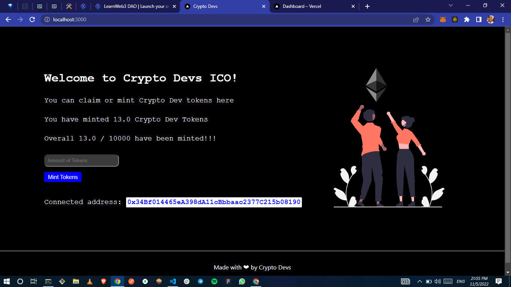

# Launch your own Initial Coin Offering

### Table of Content

-   [Title](#launch-your-own-initial-coin-offering)
-   [Description](#description)

# Description

### Breakdown

This is a [Learn Web3](https://learnweb3.io) project built using **Hardhat** and **Next.js**.
A [smart contract](./_hardhat/contracts/CryptoDevToken.sol) showing how to create your own ERC20 coin that allows creation of a fixed amount of tokens available, current NFT owners get a certain number of tokens

#### Theory

-   What is an ERC20?
    -   ERC-20 is a technical standard; it is used for all smart contracts on the Ethereum blockchain for token implementation and provides a list of rules that all Ethereum-based tokens must follow.
    -   Please look at all the ERC20 [functions](https://docs.openzeppelin.com/contracts/2.x/api/token/erc20) before moving ahead.

#### Requirement

-   There should be a max of 10,000 CD tokens.
-   Every Crypto Dev NFT holder should get 10 tokens for free but they would have to pay the gas fees.
-   The price of one CD at the time of ICO should be 0.001 ether.
-   There should be a website that users can visit for the ICO.

